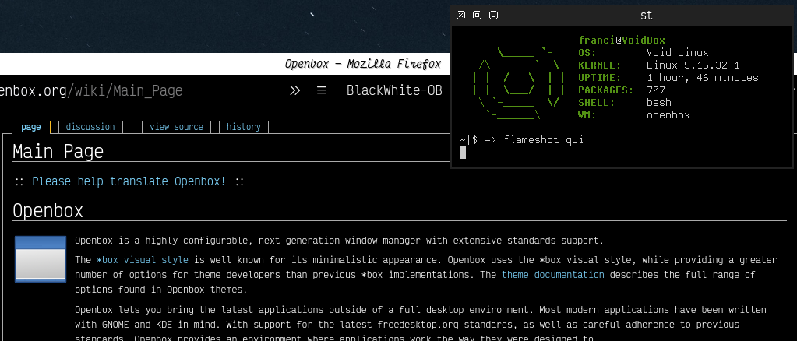
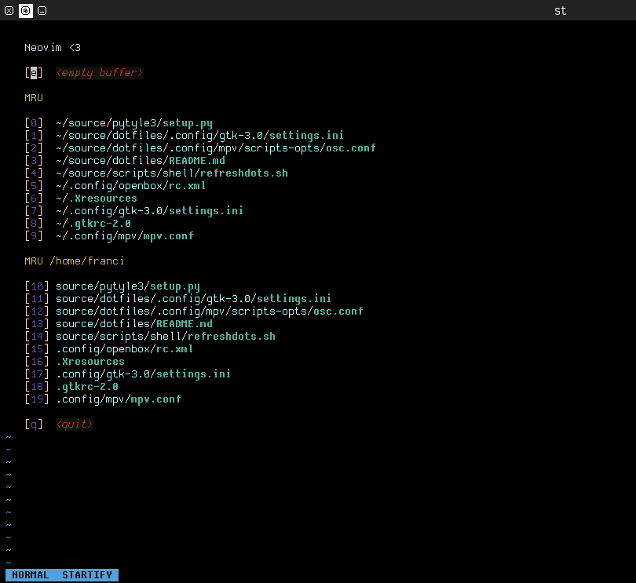

# dots
hi, these are my dotfiles!

Other than the ascii wallpapers (that are from [SystemThirtyTwo](https://gitlab.com/SystemThirtyTwo/ascii-wallpapers)), all of the wallpapers are made by me in Inkscape(most of them are traced images taken from various places on the internet).

The Openbox theme (the BlackWhite-OB folder) was made by me following the [official openbox theming documentation](http://openbox.org/wiki/Help:Themes).

If you are interested in the svgs file for the wallpapers take a look at [this repo](https://gitlab.com/francicoria/vectorart).
